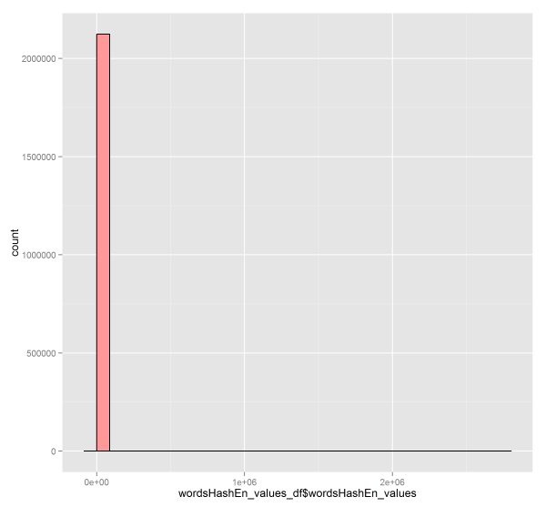

```{r echo=FALSE, message=FALSE, warning=FALSE}
library(ggplot2)
```

# Executive summary

The project goal is to create an application whose user would be suggested the 3 words that have the most chance of coming after the text he just typed. The application can be as simple as a text field with a popup showing the best 3 following words. The prediction is based on a list of documents, called corpus, that are supposed to be representative of a specific language. In this document, we'll explore and prepare the data set before processing it. We'll see that a fair amount of cleanup and filtering is required to provide meaningful results. Finally, we'll expose a possible way of designing the application in an efficient way by looking for the frequency of word series in the corpus and then keeping the best series in hash tables.


# Corpus exploration

After the original package is unzipped, we have four data sets available in four directories, one for each language to support. The directories are named according to the locale: de_DE for German, en_US for American English, fi_FI for Finnish and ru_RU for Russian. We have 3 files available for each language. The files are named according to the source of data: blogs, newspapers or Twitter (2).


```{r echo=FALSE}
lines_en <- list(blogs=899288, news=1010242, twitter=2360148)
lines_de <- list(blogs=371440, news=244743, twitter=947774)
lines_fi <- list(blogs=439785, news=485758, twitter=285214)
lines_ru <- list(blogs=337100, news=196360, twitter=881414)
```
```{r echo=FALSE}
size_en <- list(blogs=210160014, news=205811889, twitter=167105332)
size_de <- list(blogs=85459666, news=95591959, twitter=75578341)
size_fi <- list(blogs=108503595, news=94234350, twitter=25331142)
size_ru <- list(blogs=116855835, news=118996424, twitter=105182346)
```
```{r echo=FALSE, message=FALSE, warning=FALSE}
wc_en <- list(blogs=37334641, news=2643986, twitter=30373906)
wc_de <- list(blogs=6191461, news=13219530, twitter=11803694)
wc_fi <- list(blogs=12732199, news=10446086, twitter=3152831)
wc_ru <- list(blogs=9455535, news=9202756, twitter=9289235)
```
```{r echo=FALSE, message=FALSE, warning=FALSE}
avg_line_en <- list(blogs=230, news=202, twitter=69)  #avgLineSize
avg_line_de <- list(blogs=224, news=382, twitter=77)
avg_line_fi <- list(blogs=234, news=184, twitter=83)
avg_line_ru <- list(blogs=190, news=331, twitter=66)
```

Here is the size of all files in the corpus, in bytes, then the number of lines per file and finally the number of words in each file. Please notice this doesn't give the number of distinct words yet.

| FILE SIZE (BYTES)  | English          | German           | Finnish          | Russian          |
|-------------|:----------------:|-----------------:|-----------------:|-----------------:|
| Blogs       | `r format(size_en$blogs)`   | `r format(size_de$blogs)`   | `r format(size_fi$blogs)`   | `r format(size_ru$blogs)`   |
| Newspapers  | `r format(size_en$news)`    | `r format(size_de$news)`    | `r format(size_fi$news)`    | `r format(size_ru$news)`    |
| Twitter     | `r format(size_en$twitter)` | `r format(size_de$twitter)` | `r format(size_fi$twitter)` | `r format(size_ru$twitter)` | 

| LINES COUNT | English          | German           | Finnish          | Russian          |
|-------------|:----------------:|-----------------:|-----------------:|-----------------:|
| Blogs       | `r format(lines_en$blogs)`   | `r format(lines_de$blogs)`   | `r format(lines_fi$blogs)`   | `r format(lines_ru$blogs)`   |
| Newspapers  | `r format(lines_en$news)`    | `r format(lines_de$news)`    | `r format(lines_fi$news)`    | `r format(lines_ru$news)`    |
| Twitter     | `r format(lines_en$twitter)` | `r format(lines_de$twitter)` | `r format(lines_fi$twitter)` | `r format(lines_ru$twitter)` | 

| WORD COUNT  | English          | German           | Finnish          | Russian          |
|-------------|:----------------:|-----------------:|-----------------:|-----------------:|
| Blogs       | `r format(wc_en$blogs)`   | `r format(wc_de$blogs)`   | `r format(wc_fi$blogs)`   | `r format(wc_ru$blogs)`   |
| Newspapers  | `r format(wc_en$news)`    | `r format(wc_de$news)`    | `r format(wc_fi$news)`    | `r format(wc_ru$news)`    |
| Twitter     | `r format(wc_en$twitter)` | `r format(wc_de$twitter)` | `r format(wc_fi$twitter)` | `r format(wc_ru$twitter)` | 

Here are the average line sizes.

| AVG. LINES LENGTH | English          | German           | Finnish          | Russian          |
|-------------|:----------------:|-----------------:|-----------------:|-----------------:|
| Blogs       | `r format(avg_line_en$blogs)`   | `r format(avg_line_de$blogs)`   | `r format(avg_line_fi$blogs)`   | `r format(avg_line_ru$blogs)`   |
| Newspapers  | `r format(avg_line_en$news)`    | `r format(avg_line_de$news)`    | `r format(avg_line_fi$news)`    | `r format(avg_line_ru$news)`    |
| Twitter     | `r format(avg_line_en$twitter)` | `r format(avg_line_de$twitter)` | `r format(avg_line_fi$twitter)` | `r format(avg_line_ru$twitter)` | 

We can see here that the average line lengths in Russian is far from being simply the number of bytes divided by the number of lines. This is because of the encoding which requires 2 bytes in most cases for Russian language. 
We can also see that twitter lines are usually much shorter than the blogs and newspapers entries. The reason might be caused by the tweet limit of 140 characters. Because of those differences, we could imagine that the text is composed differently in the 3 files. This may impact the vocabulary (shorter words for tweets, for instance) and the grammar (shorter sentences or bad grammar). So it's important to keep learning from the 3 sources even if we work with samples of the original data set.
Finally, we also see that newspaper excerpts in German and Russian tend to be longer than for English and Finnish, on average. 

```{r echo=FALSE}
# precomputed values on final data set

# distinct words count (not filtered, not cleaned) => w variable stored in "raw_stats_final_set.RData""
diff_wc_en <- data.frame(Source = factor(c("blogs", "news", "twitter"), levels=c("blogs", "news", "twitter")), count_distinct=c(1103677, 197857, 1290203))

# this is after merging the 3 hash maps of words
totalDiffWords <- 2123961

mostOccuringWord <- "the"
mostOccuringFreq <- 2627984
lowFreq = c(1432150,  232970,  102421,   59333,   39632,   28731,   21702,   17349,   14106,   11727)
lowFreqRatio = lowFreq/totalDiffWords
freq1 <- lowFreqRatio[[1]]
freq5 <- sum(lowFreqRatio[1:5])
freq10 <- sum(lowFreqRatio)
```

In the following chart, we see the number of different words for each of the 3 files in the English data set before data set cleaning and filtering.

```{r echo=FALSE}
ggplot(data=diff_wc_en, aes(x=Source, y=count_distinct)) + geom_bar(stat="identity", fill="#FF9999", colour="black") + 
  geom_text(aes(x=Source, y=count_distinct/2, ymax=count_distinct, label=count_distinct)) + 
  xlab("Source file") + ylab("Count of distinct words") +
  ggtitle("Counting of distinct words for the 3 English files before cleaning")
```

If we merge the 3 sets of words together, we have `r format(totalDiffWords)` different words found. At first glance, there seems not to be so many words in common in the 3 files. If we expected some differences, we didn't expect it to be so emphasized. In fact, the word that occurs the most is `r mostOccuringWord` which appears `r mostOccuringFreq` times, but most of the words only appear very few times. `r freq1`% of the words only appear 1 time, `r freq5`% of the words appear 5 times or less and `r freq10`% of the words appear 10 times or less. The following plot shows how words with low frequency (count) are more common than other words.

```{r echo=FALSE}
#ggplot(data=wordsHashEn_values_df, aes(wordsHashEn_values_df$wordsHashEn_values)) + geom_histogram(fill="#FF9999", colour="black")
```



In the previous counting, we considered only white spaces and new lines as words separators, whithout any further transformations. Here is a sample of what we get: "you", "you).", "you?", "wow!", "tonight!!", "school...wow!", "\$\$\$", ":-)", "arrrgh", "recieved" or "$1.200.". In those so called "words", we have prices, misspellings, emoticons, onomatopoeia and punctuation. This is the reason why we have so many words with very low frequency. Clearly we have to better define what is a word and what is not. This can involve ignoring some complete chains of characters or just stripping some characters from them. For example, we want to convert "you)." into "you" and not ignore the entry completely.


_Important remark_: We'll focus on the English language data set for the rest of the document but the strategy is similar for the 3 other languages. Besides, because of the large size of the corpus and the limited time we have, the following exploration was performed using a small part of each of the English files. 10% of the lines were kept, taken randomly. The following table shows the word count in the sampled English data set before cleaning. Those numbers will be used to observe the effects of cleaning and filtering.

```{r echo=FALSE}
wc_en10 <- list(blogs=251347, news=46529, twitter=265344)
total_wc_en10 <- 448865
```

| DISTINCT WORD COUNT (10% sample)  | English                     |
|-----------------------------------|:---------------------------:|
| Blogs                             | `r format(wc_en10$blogs)`   |
| Newspapers                        | `r format(wc_en10$news)`    |
| Twitter                           | `r format(wc_en10$twitter)` |
|-----------------------------------|-----------------------------|
| 3 files merged                    | `r format(total_wc_en10)`   |

# Data source cleaning and filtering

In order to achieve our goal, we first have to define what is a word and what influences the next word to come. 

We need to think about how to deal with the following special cases in the text: misspelling, hyphenation, abbreviations, capitalization, punctuation and other special characters, white spaces and numbers. We can also think about how to deal with some special words: profanity, very common words, synonyms, onomatopoeia and names (places, people...). Finally, the grammar and position of the word in the sentence can also influence the list of words that come next.

## Capitalization

There are 2 cases of capital letters to handle. The first case is when the word always takes one or more capital letters, like for people or location names for instance. The second case is when the word only sometimes takes a capital letter, like the first letter of a sentence is English. The counting of words should not be affected by the fact that a word sometimes takes a capital letter or not. This is mostly a matter of grammar and context. So the idea is to ignore capitalization of words in order to get the right number of occurrences in the language, whatever the context.

Ideally, we should identify words that always take 1 or more capital letters so that the predictor shows it with correct case. This could be done later as an improvement but it's not done here. 

## Punctuation

There are different ways to deal with a word attached to or including punctuation. We can keep it as is, remove the punctuation or ignore the whole word. Keeping it as is could be a valid possibility if we had some clues that it influences the next word to come. For instance, we could imagine that the list of words possibly coming after "name" is different than the list that comes after "name.". However, this solution requires some further studies that we don't have time to undertake now. Stripping punctuation seems a better solution compared to the one that completely ignores the word. Indeed, ignoring if completely would disadvantage words that often come at the end of sentences or before a comma, for instance.

Punctuation will be completely removed from the corpus.

## Numbers

Words containing numbers, whether entirely or partially, should normally not be taken into account. These can be enumerations ("1st", "2nd"...), currencies ("$2.000"...) or amounts for instance, but we'll not try to predict what will come after such words. Numbers can also be used in some kind of abbreviations or slang, like in "sk8" for "skate", for instance. We'll not cover those cases either. 

Words containing numbers will be completely removed from the corpus.

## Misspellings, onomatopoeia, names and foreign words

We could check our list of words against a dictionary and remove the words that a not inside. This has pros and cons. On the pros side, we are making sure we only get words with the right spelling, even if the word is frequently misspelled. On the cons side, we are removing common words such as names, brands or locations. For instance, we would be missing the association of "Iphone" and "Apple", which could make some people really mad.

A possible solution would be to run an automatic spelling correction tool on the words set. This would handle the case of words with missing umlauts in German, for instance. However, we would be taking the risk of having words wrongly corrected by the tool (see Cupertino effect, reference 8). So we'll not choose this option.

In the end, we'll keep words spelled the wrong way, hoping that those will have a small frequency compared to the same word with correct spelling. We can hope that in the list of words appearing after a specific words, the top 3 will have the correct spelling because (hopefully) most people have good spelling. We'll also keep onomatopoeia and foreign words if they are used frequently enough to be suggested.

## Stop words and profanity

Stop words and words that are filtered out before or after processing of natural language data (see reference 10). In a typical application, the stop words are the most common words in the language (e.g. "the", "a"...) that are there for grammatical reasons and are therefore often excluded from language processors. We will keep those in our case since we actually would like so see our users write grammatically correct text. 

However, we wouldn't want to be accused of encouraging usage of profanity in documents or conversations. So we'd like to remove those from the result set. Actually, we could hope that profanity is sparse in our learning data set and won't appear in the top 3 results, but we can't be sure. 

If it's quite clear we shouldn't suggest profanity, should we suggest correct words after the user typed bad words ? Should we suggest 'you' after the user typed the _F_ word, for instance ? Again, I would say that the product could be accused of encouraging profanity if it were completing expressions that contain some. It's hard to filter expressions that convey some bad meaning with regular words, but we can at least nor propose any word after bad words are typed.

From those decisions, we'll ban bad words from suggestions and won't suggest words after profality is typed. A list of profanity is available at reference 9.

## Other topics

__Stemming__: Stemming is a technique with which we handle the roots of words instead of the words themselves. For instance, "cities" and "city" would both be considered as "citi" when stemming is used. The advantage is that it increases the coverage of the corpus since some words that might not be in the corpus would be considered through their stem. However, it would then be more difficult to suggest the right word afterwords. If we encountered "city" and not "cities", it would be harder to find out that the plural or singular form of the word is the best suggestion since what is stored is simply "citi". We have to take grammar into account. As a conclusion, stemming will only be considered if we get enough time.

__Hyphenation__: Hyphenation happens when words are cut in the middle to achieve correct line alignment. The number of hyphens appearing in the end of lines is 0. So this doesn't happen in the data sets we are treating.

__Eszett or double-s__: In German, the letter 'ß' can also sometimes be written 'ss', especially when the 'ß' letter is not available. However, words written both ways don't always have the same meaning. So "bußen" and "bussen" are not the same words. In order to keep this possible difference of meaning, words written with 'ß' or 'ss' are kept separate, even if that means that the word gets a lower ranking than it should because of substitutions. 

__Abbreviations__: Actually, abbreviations do not seem to be a problem in this use case. As long as they are used frequently enough, they are valid candidates for prediction.

## Conclusion and final filtering

```{r echo=FALSE}
wc_cleaned_en10 <- 172691
wc_cleaned_remove1_en10 <- 69603
wc_cleaned_remove2_en10 <- 50302
cleanup_ratio_en10  <- wc_cleaned_en10/total_wc_en10
cleanup_ratio_remove1_en10  <- wc_cleaned_remove1_en10/total_wc_en10
cleanup_ratio_remove2_en10  <- wc_cleaned_remove2_en10/total_wc_en10
```

After cleaning and filtering the 10% sample of the English corpus, we end up with only `r format(wc_cleaned_en10)` distinct words instead of `r format(total_wc_en10)`. We have removed `r format((1-cleanup_ratio_en10)*100)`% of the distinct words. The number is still high and we kept a lot of words that do not really make sense. Here are some of the first words remaining in the list: "aaaa", "aaa", "aaaaaaargh", "aaaaaallllll", "aaaaaand"... If we keep that list, we use a total of 10Mb memory. Knowing that we have to keep the 3 next words that come after each one of those words, that would make approximatively 40Mb ram usage (probably less since many words won't have 3 suggestions). 

This memory usage may or may not be acceptable. If it's not, it's possible to further reduce the memory footprint by removing the words that occur only once or twice in the data set. We would only be able to propose respectively 1 or 2 words for those anyway. If we are afraid of removing real words from the set, we could remove only those that do not appear in a dictionary. If we simply remove all words occuring once, we keep `r format(wc_cleaned_remove1_en10)` distinct words (`r format((1-cleanup_ratio_remove1_en10)*100)`% removed). If we remove all words occuring once or twice, we keep `r format(wc_cleaned_remove2_en10)` distinct words (`r format((1-cleanup_ratio_remove2_en10)*100)`% removed).

```{r echo=FALSE}
aardvark_position <- 15
aardvark_freq <- 5
the_freq <- 296140
```

At the moment, we'll keep only the words that occur at least 3 times. This gives a memory footprint of 3Mb, which would make 12Mb with the 3 next word suggestions. It's remarkable that the top 100 words in the list mostly contains words in the dictionary. "aardvark" appears at the `r aardvark_position`th position in alphabetical order after multiple variations around "aahhh" (among others) and is present `r format(aardvark_freq)` times in the 10% sample that was used. The word "the" is the most frequent word in the set and it occurs `r format(the_freq)` times.

# Plans for building the application

The application needs to provide the best suggestion of 3 words that follow the last words a user typed. I plan to have a simple user interface with a text field in which the user can type some text. After he types a word and presses the space bar, a popup would appear to suggest the 3 most frequent words. Then the user can either continue to type or he can select one of the 3 options in the popup. In this last case, the word would be automatically added to the text. If the field is blank, we could also suggest the 3 most frequent words learned from the corpus.

If for some reason I cannot use that popup box, plan B would be to have a button available that the user can press at any time. If the text field is not empty, a dialog would open to let the user select one of the 3 most common words after the last one he typed. The word the user selects would be appended at the end of the text field.

In order to build this application, I need to go further into the frequency analysis of the words in the corpus. At the moment, I only analyzed the frequency of words without taking the following ones into account. The next step is to consider pairs of words instead of isolated words. For example, I could calculate the frequency of entries such as "the end" or "last train". "the last train" would be divided into "the last" and "last train". After that, we could go on with analyzing the frequency of larger series of words (series of 3 words, 4 words and so on...).

During application execution, it's important to find quickly the entries that starts with the last words the user typed. I will take extra care into choosing efficient data structures to quickly find the suggestions.

# References and resources

(1) _HC Corpora_: http://www.corpora.heliohost.org/aboutcorpus.html
(2) _HC Corpora statistics_: http://www.corpora.heliohost.org/statistics.html
(3) _Natural Language Processing in R_: http://cran.r-project.org/web/views/NaturalLanguageProcessing.html
(4) _tm package in R_: https://cran.r-project.org/web/packages/tm/index.html
(5) _tm package release notes_: https://cran.r-project.org/web/packages/tm/news.html
(6) _Eszett_: https://en.wikipedia.org/wiki/ß
(7) _how do you implement a good profanity filter_: http://stackoverflow.com/questions/273516/how-do-you-implement-a-good-profanity-filter
(8) _Cupertino effect_: https://en.wikipedia.org/wiki/Cupertino_effect
(9) _Shuttershock list of dirty-naughty-obscene-and-otherwise-bad words_: https://github.com/shutterstock/List-of-Dirty-Naughty-Obscene-and-Otherwise-Bad-Words
(10) _stop words_: https://en.wikipedia.org/wiki/Stop_words
(11) _tm FAQ_: http://tm.r-forge.r-project.org/faq.html
(12) _Shakespeare text mining_: http://www.r-bloggers.com/text-mining-the-complete-works-of-william-shakespeare/
